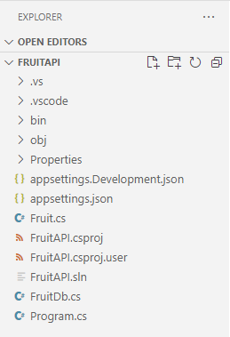

---
lab:
  title: "Exercice\_: Interagir avec une API ASP.NET Core minimale"
  module: 'Module: Interact with an ASP.NET Core minimal API'
---

Dans cet exercice, vous exécutez une API ASP.NET Core minimale localement et explorez l’API et le code sous-jacent. Vous allez également publier l’API dans Azure App Service. 

À l’issue de cet exercice, vous pourrez :

* naviguer dans une API documentée
* définir les points de terminaison pour les opérations HTTP
* identifier les exigences des opérations HTTP dans l’API
* Publier une application dans Azure App Service

## Prérequis

Pour effectuer l’exercice, les éléments suivants doivent être installés dans votre système :

* [Visual Studio Code](https://code.visualstudio.com)
* [La dernière version du kit de développement logiciel (SDK) .NET 8.0](https://dotnet.microsoft.com/download/dotnet/8.0)
* l’[Extension C#](https://marketplace.visualstudio.com/items?itemName=ms-dotnettools.csharp) pour Visual Studio Code
* l’extension [Azure Resources](https://marketplace.visualstudio.com/items?itemName=ms-azuretools.vscode-azureresourcegroups) pour Visual Studio Code.
* L’extension [Azure App Service](https://marketplace.visualstudio.com/items?itemName=ms-azuretools.vscode-azureappservice) pour Visual Studio Code.
* Compte Azure avec un abonnement actif. Si vous n’en avez pas, vous pouvez vous inscrire à une évaluation gratuite dans la page [https://azure.com/free](https://azure.com/free).

**Estimation de la durée de cet exercice** : 30 minutes

## Informations sur l’API

L’API interagit avec une base de données en mémoire qui contient les champs suivants :

Champ | Type | Description
--- | --- | ---
`id` | entier | Clé pour les données
`name` | string | Nom du fruit
`instock` | booléen | Indique si le fruit est en stock

La documentation Swagger a été créée à l’aide du package Swashbuckle.

>**Remarque :** des exemples de données sont créés chaque fois que l’API est démarrée.


## Télécharger et exécuter le code de l’API Fruit

Dans cette section, vous allez :

* Téléchargement du code de l’API
* Exécuter l’API localement
* Ouvrir la documentation de l’API dans un navigateur

### Tâche 1 : télécharger le code de l’API

1. Cliquez avec le bouton droit sur le lien suivant, puis sélectionnez l’option **Enregistrer le lien**. 

    * [Code du projet FruitAPI](https://raw.githubusercontent.com/MicrosoftLearning/APL-2002-develop-aspnet-core-consumes-api/master/Allfiles/Downloads/FruitAPI.zip)

1. Ouvrez l’**Explorateur de fichiers** et accédez à l’emplacement où le fichier a été enregistré.

1. Décompressez le fichier dans son propre dossier.

#### Tâche 2 : exécuter l’API localement

1. Dans Visual Studio Code, sélectionnez l**Fichier**, puis **Ouvrir le dossier** dans le menu.

1. Accédez à l’emplacement où vous avez décompressé les fichiers projet et sélectionnez le *dossier FruitAPI*.

1. La structure du projet dans le volet **Explorateur** doit être similaire à la capture d’écran suivante. Si le volet **Explorateur**n’est pas visible, dans le menu, sélectionnez **Affichage**, puis **Explorateur**.

    

1. Ouvrez un terminal en sélectionnant **Terminal**, puis **Nouveau terminal**, ou utilisez le raccourci clavier **Ctrl+Maj+’**.

1. Dans le volet **** terminal`dotnet`, exécutez la commande suivante :

    ```
    dotnet run
    ```

1. Voici un exemple de sortie que vous verrez dans le volet **Terminal**. Notez la ligne `Now listening on: http://localhost:5050` dans la sortie. Elle indique l’hôte et le port de l’API.

    ```
    info: Microsoft.EntityFrameworkCore.Update[30100]
          Saved 3 entities to in-memory store.
    info: Microsoft.Hosting.Lifetime[14]
          Now listening on: http://localhost:5050
    info: Microsoft.Hosting.Lifetime[0]
          Application started. Press Ctrl+C to shut down.
    info: Microsoft.Hosting.Lifetime[0]
          Hosting environment: Development
    info: Microsoft.Hosting.Lifetime[0]
          Content root path: 
          <project location>
    ```

### Tâche 3 : ouvrir la documentation de l’API dans un navigateur

1. Pour afficher l’API, vous pouvez entrer `http://localhost:5050` la barre d’adresses ou ** Ctrl+cliquer** sur le `Now listening on: http://localhost:5050`lien dans le **terminal** indiqué précédemment. La page affiche le message « Cette page localhost est introuvable ».

1. Ajoutez l’URL dans le navigateur avec `/swagger`. Le point de terminaison `/swagger` est généralement l’emplacement où vous trouverez la documentation d’une API Swagger. L’URL complète de la documentation Swagger est `http://localhost:5050/swagger`. Votre navigateur doit désormais afficher une page web ressemblant à la capture d’écran suivante :

    

## Effectuer des opérations dans l’API

Dans cette section, vous allez :

* Effectuer plusieurs opérations sur les exemples de données
* Identifier les exigences de point de terminaison et de données pour les opérations

### Tâche 1 : exécuter une opération `GET`

1. Développez l’opération **GET** avec le descripteur **Obtenir tous les fruits** en cliquant n'importe où dans le cadre de l’opération **GET**.

1. Explorez les sections de l’opération et notez les informations indiquées dans le tableau suivant.

    | Section | Description |
    |---|--|
    | **Point de terminaison** | Illustré dans l’en-tête de l’opération. Le point de terminaison s’affiche en tant que `/fruits`. L’URL complète est l’URL de base de l’API ajoutée avec le point de terminaison spécifié, `http://localhost:5050/fruits` dans notre exemple. |
    | **Paramètres** | Aucun paramètre n’est requis pour cette opération. |
    | **Type de média** | Spécifie le type d’encodage de média que l’opération va retourner. |
    | **Exemple de valeur** | Affiche le schéma des données retournées par l’opération. Notez que cette opération retourne un tableau JSON. |

1. Exécutez l’opération en sélectionnant le bouton **Essayer**, puis en sélectionnant **Exécuter**.

1. La section **Réponses** de l’opération a été mise à jour avec de nouvelles informations. Notez ce qui suit :

    * **URL de la demande :** accessible dans l’opération.
    * **Réponse du serveur :** affiche le code de réussite de l’opération et le **corps de la réponse** affiche les trois exemples d’enregistrements.

### Tâche 2 : exécuter une opération `POST`

1. Développez l’opération **POST** avec le descripteur **Créer un nouveau fruit** en cliquant n’importe où dans la boîte de l’opération **POST**.

1. Explorez les sections de l’opération et notez les informations indiquées dans le tableau suivant.

    | Section | Description |
    |---|--|
    | **Point de terminaison** | Le point de terminaison s’affiche en tant que `/fruits`. L’URL complète est l’URL de base de l’API ajoutée avec le point de terminaison spécifié, `http://localhost:5050/fruits` dans notre exemple. |
    | **Paramètres** | Aucun paramètre n’est requis pour cette opération. |
    | **Corps de la demande** | Le **corps de la demande** est requis, car l’API s’attend à ce que les données s’ajoutent à la liste et requiert le type de média `application/json`. |
    | **Exemple de valeur** | Affiche le schéma des données que l’API s’attend à recevoir. |  

1. Pour exécuter l’opération, sélectionnez le bouton **Essayer**. 

1. Remplacez le JSON dans la zone d’entrée sous la section **Corps de la demande** par les éléments suivants :

    ```json
    {
        "id": 0,
        "name": "Pear",
        "instock": true
    }
    ```

    >**Remarque :** la base de données affecte sa propre valeur d’index lors de l’ajout de données. Il doit donc simplement y avoir une valeur dans le champ `id`.

1. La section **Réponses** de l’opération a été mise à jour avec de nouvelles informations. Notez ce qui suit :

    * **URL de la demande :** accessible dans l’opération.
    * **Réponse du serveur :** affiche le code de réussite de l’opération et le **corps de la réponse** affiche les enregistrements ajoutés à la base de données.

1. Exécutez la commande `GET` dans la section **Obtenir tous les fruits** et notez qu’un enregistrement pour *Poire* est maintenant inclus.

### Tâche 3 : exécuter une opération `DELETE`

1. Développez l’opération **DELETE** avec le descripteur **Supprimer un fruit par Id** en cliquant n’importe où dans la boîte de l’opération **DELETE**.

1. Explorez les sections de l’opération et notez les informations indiquées dans le tableau suivant.

    | Section | Description |
    |---|--|
    | **Point de terminaison** | Le point de terminaison s’affiche en tant que `/fruits/{id}`. L’URL complète est l’URL de base de l’API ajoutée avec le `id` spécifié pour la suppression. Par exemple, `http://localhost:5050/fruits/1` pointe vers l’enregistrement où `id` est égal(e) à `1`.
    | **Paramètres** | Nécessite que l’enregistrement `id` soit transmis dans l’URL de la demande. |

1. Pour exécuter l’opération, sélectionnez le bouton **Essayer**. 

1. Supprimez l’enregistrement `Apple` dans les exemples de données en saisissant un(e) `1` dans le `id` champ de la section **Paramètres**, puis en sélectionnant **Exécuter**.

1. La section **Réponses** de l’opération a été mise à jour avec de nouvelles informations. Notez ce qui suit :

    * **URL de la demande :** accessible dans l’opération.
    * **Corps de la réponse :** affiche l’enregistrement supprimé.
    * **Code :** affiche le code de réussite de l’opération.

1. Exécutez la commande `GET` dans la section **Obtenir tous les fruits** et notez que l’enregistrement pour *Pomme* est maintenant supprimé.

Lorsque vous êtes prêt à passer à la section suivante de l’exercice :

* Fermez le navigateur et arrêtez l’API Fruit en sélectionnant **Ctrl + C** dans le terminal dans lequel l’API s’exécute.

## Publier l’API sur Azure App Service

Dans cette section, vous allez :

* utiliser l’extension Ressources Azure pour vous connecter à Azure
* utiliser l’extension Azure App Service pour publier l’API sur App Service

### Tâche 1 : Se connecter à Azure

1. Utilisez l’extension Ressources Azure pour ouvrir le volet.

    

1. Sélectionnez **Se connecter à Azure**.

    Ce script ouvre une fenêtre de navigateur permettant de vous connecter à votre compte Azure. Vous pouvez fermer cette fenêtre une fois le processus de connexion terminé. 

1. Une fois la connexion terminée, l’extension affiche la liste des abonnements disponibles dans votre compte. La capture d’écran suivante montre un exemple.

    

### Tâche 2 : créer une nouvelle application web

1. Sélectionnez **Ctrl + Maj + P** pour ouvrir la palette de commandes et saisissez **Créer une application web** pour filtrer la liste et sélectionner l’option **Azure App Service : Créer une application web… (avancé)**. 

1. Si votre compte comporte plusieurs abonnements, vous devez sélectionner l’abonnement que vous souhaitez utiliser pour le déploiement. 

1. Entrez un nom global unique pour la nouvelle application web. Vous pouvez essayer `fruitapi-<name>` et remplacer `<name>` par votre nom ou vos initiales.

1. Sélectionnez **+Créer un groupe de ressources** et acceptez la valeur par défaut ou saisissez `fruitapi-rg`.

1. Sélectionnez **.NET 8 (STS)** comme pile d’exécution.

1. Sélectionnez **Linux** comme Système d’exploitation.

1. Sélectionnez l’emplacement à proximité pour les nouvelles ressources.

1. Sélectionnez **Créer un plan App Service** et acceptez la valeur par défaut ou saisissez un autre nom. 

1. Sélectionnez **Gratuit (F1) Essayer Azure gratuitement** pour obtenir le niveau tarifaire.

1. Sélectionnez **Ignorer pour le moment** quand vous êtes invité(e) à sélectionner une nouvelle ressource Application Insights.

L’outil crée les ressources nécessaires dans Azure et compile le code.

### Tâche 3 : déployer l’application web et parcourir le site en cours d’exécution

1. Une fois que les ressources sont créées et que le code a terminé la compilation, une fenêtre s’affiche, vous invitant à **déployer**. Sélectionnez l’option **Déployer** . 

    Le système génère une version de mise en production du code et le déploie sur les ressources que vous avez créées précédemment.

1. Une fois le déploiement terminé, une nouvelle fenêtre contextuelle s’affiche avec l’option **Parcourir le site web**. Sélectionnez **Parcourir le site web**.

1. Dans la fenêtre du navigateur qui s'ouvre, vous devrez peut-être ajouter `/fruits` à la fin de l’URL. La sortie brute de l’API affiche toutes les données.

    >**REMARQUE :** l’interface utilisateur Swagger est désactivée, car elle n’est activée que pour les environnements de développement. Le déploiement sur App Service est considéré comme un environnement non dev, sauf si vous effectuez une configuration supplémentaire.

Félicitations, vous avez déployé votre API vers Azure App Service.

>**Remarque :** il est recommandé de supprimer des ressources d’Azure dont vous n’avez plus besoin. Vous pouvez supprimer toutes les ressources créées dans cette section de l’exercice en supprimant le groupe de ressources créé précédemment dans le Portail Azure.

## Révision

Dans cet exercice, vous avez appris à effectuer les opérations suivantes :

* naviguer dans une API documentée
* définir les points de terminaison pour les opérations HTTP
* identifier les exigences des opérations HTTP dans l’API
* publier une application dans Azure App Service 
