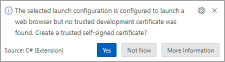

---
lab:
  title: "Exercice\_: implémenter des opérations HTTP dans des applications web Blazor ASP.NET Core"
  module: 'Module: Implement HTTP operations in ASP.NET Core Blazor Web apps'
---

Dans cet exercice, vous apprenez à ajouter du code à une application web ASP.NET Core Blazor pour créer le client HTTP et effectuer les opérations `GET`, `POST`, `PUT` et `DELETE`. Ce code est ajouté aux fichiers *.razor.cs* du code-behind. Le code de rendu des données dans les fichiers *.razor* est terminé.

## Objectifs

À l’issue de ce module, vous pourrez :

* implémenter `IHttpClientFactory` en tant que client HTTP
* Implémenter des opérations HTTP dans des applications web ASP.NET Blazor

## Prérequis

Pour effectuer l’exercice, les éléments suivants doivent être installés dans votre système :

* [Visual Studio Code](https://code.visualstudio.com)
* [La dernière version du kit de développement logiciel (SDK) .NET 8.0](https://dotnet.microsoft.com/download/dotnet/8.0)
* L’[Extension C#](https://marketplace.visualstudio.com/items?itemName=ms-dotnettools.csharp) pour Visual Studio Code

**Estimation de la durée de cet exercice** : 30 minutes

## Scénario de l’exercice

Cet exercice comporte deux composants :

* une application qui envoie des requêtes HTTP à une API L’application web s’exécute sur `http://localhost:5010`.
* une API qui répond aux requêtes HTTP L’API s’exécute sur `http://localhost:5050`


## Téléchargement du code

Dans cette section, vous allez télécharger le code de l’application web Fruit et de l’API Fruit. Vous allez également exécuter l’API Fruit localement afin qu’elle soit disponible pour l’application web.

### Tâche 1 : télécharger et exécuter le code de l’API

1. Cliquez avec le bouton droit sur le lien suivant, puis sélectionnez l’option **Enregistrer le lien**. 

    * [Code du projet FruitAPI](https://raw.githubusercontent.com/MicrosoftLearning/APL-2002-develop-aspnet-core-consumes-api/master/Allfiles/Downloads/FruitAPI.zip)

1. Ouvrez l’**Explorateur de fichiers** et accédez à l’emplacement où le fichier a été enregistré.

1. Décompressez le fichier dans son propre dossier.

1. Ouvrez **Terminal Windows**, ou une **invite de commandes**, puis accédez à l’emplacement où vous avez extrait le code de l’API.

1. Dans le volet du **Terminal Windows**, exécutez la commande `dotnet` suivante :

    ```
    dotnet run
    ```

1. Voici un exemple de sortie générée. Notez la ligne `Now listening on: http://localhost:5050` dans la sortie. Elle indique l’hôte et le port de l’API.

    ```
    info: Microsoft.EntityFrameworkCore.Update[30100]
          Saved 3 entities to in-memory store.
    info: Microsoft.Hosting.Lifetime[14]
          Now listening on: http://localhost:5050
    info: Microsoft.Hosting.Lifetime[0]
          Application started. Press Ctrl+C to shut down.
    info: Microsoft.Hosting.Lifetime[0]
          Hosting environment: Development
    info: Microsoft.Hosting.Lifetime[0]
          Content root path: 
          <project location>
    ```

>**Remarque :** laissez l’API Fruit en cours d’exécution tout au long de l’exercice. 

### Tâche 2 : télécharger et ouvrir le projet d’application web

1. Cliquez avec le bouton droit sur le lien suivant, puis sélectionnez l’option **Enregistrer le lien**. 

    * [Code du projet code-behind de l’application web Fruit](https://raw.githubusercontent.com/MicrosoftLearning/APL-2002-develop-aspnet-core-consumes-api/master/Allfiles/Downloads/FruitWebApp-codebehind.zip)

1. Ouvrez l’**Explorateur de fichiers** et accédez à l’emplacement où le fichier a été enregistré.

1. Décompressez le fichier dans son propre dossier.

1. Dans Visual Studio Code, sélectionnez l**Fichier**, puis **Ouvrir le dossier** dans le menu.

1. Accédez à l’emplacement où vous avez décompressé les fichiers projet et sélectionnez le *dossier FruitWebApp-codebehind*.

1. La structure du projet dans le volet **Explorateur** doit être similaire à la capture d’écran suivante. Si le volet **Explorateur**n’est pas visible, dans le menu, sélectionnez **Affichage**, puis **Explorateur**.

    

>**Remarque :** prenez le temps de passer en revue le code dans chacun des fichiers en cours de modification tout au long de cet exercice. Le code contient de nombreux commentaires qui peuvent vous aider à comprendre la base de code.

## Implémenter du code pour le client HTTP et les opérations HTTP

L’application web Fruit affiche les données de l’échantillon API sur la page d’accueil et dispose de fonctionnalités d’ajout, de modification et de suppression. Vous devez ajouter du code pour implémenter les opérations du client HTTP. 

### Tâche 1 : implémenter le client HTTP

1. Sélectionnez le fichier *Program.cs* dans le volet **Explorateur** pour l’ouvrir dans l’éditeur.

1. Ajoutez le code suivant entre les commentaires `// Begin HTTP client code` et `// End of HTTP client code`.

    ```csharp
    // Add IHttpClientFactory to the container and set the name of the factory
    // to "FruitAPI". The base address for API requests is also set.
    builder.Services.AddHttpClient("FruitAPI", httpClient =>
    {
        httpClient.BaseAddress = new Uri("http://localhost:5050/");
    });
    ```

1. Enregistrez les modifications apportées à *Program.cs*.

### Tâche 2 : implémenter l’opération GET

1. Sélectionnez le fichier *home.razor.cs* dans le volet **Explorateur** pour l’ouvrir et le modifier. Il se trouve dans le dossier `Components/Pages`.

1. Ajoutez le code suivant entre les commentaires `// Begin GET operation code` et `// End GET operation code`.

    ```csharp
    protected override async Task OnInitializedAsync()
    {
        // Create the HTTP client using the FruitAPI named factory
        var httpClient = HttpClientFactory.CreateClient("FruitAPI");

        // Perform the GET request and store the response. The parameter
        // in GetAsync specifies the endpoint in the API 
        using HttpResponseMessage response = await httpClient.GetAsync("/fruits");

        // If the request is successful deserialize the results into the data model
        if (response.IsSuccessStatusCode)
        {
            using var contentStream = await response.Content.ReadAsStreamAsync();
            _fruitList = await JsonSerializer.DeserializeAsync<IEnumerable<FruitModel>>(contentStream);
        }
        else
        {
            // If the request is unsuccessful, log the error message
            Console.WriteLine($"Failed to load fruit list. Status code: {response.StatusCode}");
        }
    }
    ```

1. Enregistrez les modifications apportées à *Home.razor.cs*.

1. Passez en revue le code dans le fichier  *Home.razor.cs*. Notez où `IHttpClientFactory` a été ajouté sur la page avec l’injection de dépendances.

### Tâche 3 : implémenter l’opération POST

1. Sélectionnez le fichier *Add.razor.cs* dans le volet **Explorateur** pour l’ouvrir et le modifier.

1. Ajoutez le code suivant entre les commentaires `// Begin POST operation code` et `// End POST operation code`.

    ```csharp
    private async Task Submit()
    {
        // Serialize the information to be added to the database
        var jsonContent = new StringContent(JsonSerializer.Serialize(_fruitList),
            Encoding.UTF8,
            "application/json");

        // Create the HTTP client using the FruitAPI named factory
        var httpClient = HttpClientFactory.CreateClient("FruitAPI");

        // Execute the POST request and store the response. The response will contain the new record's ID
        using HttpResponseMessage response = await httpClient.PostAsync("/fruits", jsonContent);

        // Check if the operation was successful, and navigate to the home page if it was
        if (response.IsSuccessStatusCode)
        {
            NavigationManager?.NavigateTo("/");
        }
        else
        {
            Console.WriteLine("Failed to add fruit. Status code: {response.StatusCode}");
        }
    }
    ```

1. Enregistrez les modifications apportées à *Add.razor.cs* et passez en revue les commentaires présents dans le code.

### Tâche 4 : implémenter l’opération PUT

1. Sélectionnez le fichier *Edit.razor.cs* dans le volet **Explorateur** pour l’ouvrir et le modifier.

1. Ajoutez le code suivant entre les commentaires `// Begin PUT operation code` et `// End PUT operation code`.

    ```csharp
    private async Task Submit()
    {
        // Create the HTTP client using the FruitAPI named factory
        var httpClient = HttpClientFactory.CreateClient("FruitAPI");

        // Store the updated data in a JSON object
        var jsonContent = new StringContent(JsonSerializer.Serialize(_fruitList), 
            Encoding.UTF8, "application/json");

        // Execute the PUT request
        using HttpResponseMessage response = await httpClient.PutAsync($"/fruits/{Id}", jsonContent);

        // If the response is successful, navigate back to the home page 
        if (response.IsSuccessStatusCode)
        {
            NavigationManager?.NavigateTo("/");
        }
        else
        {
            Console.WriteLine("Failed to update fruit with edits. Status code: {response.StatusCode}");
        }
    }
    ```

1. Enregistrez les modifications apportées à *Edit.razor.cs* et passez en revue les commentaires présents dans le code.

### Tâche 5 : implémenter l’opération DELETE

1. Sélectionnez le fichier *Delete.razor.cs* dans le volet **Explorateur** pour l’ouvrir et le modifier.

1. Ajoutez le code suivant entre les commentaires `// Begin DELETE operation code` et `// End DELETE operation code`.

    ```csharp
    private async Task Submit()
    {
        // Create the HTTP client using the FruitAPI named factory
        var httpClient = HttpClientFactory.CreateClient("FruitAPI");

        // Execute the DELETE request and store the response
        using HttpResponseMessage response = await httpClient.DeleteAsync("/fruits/" + Id.ToString());

        // Return to the home page 
        if (response.IsSuccessStatusCode)
        {
            NavigationManager?.NavigateTo("/");
        }
        else
        {
            Console.WriteLine("Failed to delete fruit. Status code: {response.StatusCode}");
        }
    }
    ```

1. Enregistrez les modifications apportées à *Delete.razor.cs* et passez en revue les commentaires présents dans le code.

## Exécuter et tester l’application web

### Tâche 1 : exécuter l’application web

1. Dans le menu Visual Studio Code, sélectionnez **Exécuter \| Commencer le débogage** ou appuyez sur **F5**. Une fois le projet terminé, une fenêtre de navigateur doit être lancée avec l’application web en cours d’exécution et l’affichage des exemples de données d’API, comme illustré dans la capture d’écran suivante.

    

    >**Remarque :** vous pouvez ignorer en toute sécurité l’invite ci-dessous si elle apparaît lorsque vous exécutez l’application.

    

### Tâche 1 : tester l’application web

1. Sélectionnez le bouton **Ajouter à la liste** et renseignez le formulaire généré. Ensuite, cliquez sur le bouton **Créer**.

1. Vérifiez que votre ajout apparaît en bas de la liste.

1. Choisissez un élément dans la liste à modifier et sélectionnez le bouton **Modifier**. 
1. Modifiez le **Nom de fruit** et le champ **Disponible ?**, puis sélectionnez **Mettre à jour**.

1. Vérifiez que vos modifications apparaissent dans la liste. 

1. Choisissez un élément dans la liste à supprimer et sélectionnez le bouton **Supprimer**.

1. Dans la page Supprimer, vérifiez que l’élément que vous avez sélectionné s’affiche, puis cliquez sur le bouton **Supprimer** .

1. Vérifiez que l’élément n’apparaît plus dans la liste.

Lorsque vous êtes prêt(e) à terminer l’exercice, suivez les étapes suivantes :

* Fermez le navigateur ou l’onglet de navigation et dans Visual Studio Code, sélectionnez **Exécuter \| Arrêter le débogage** ou effectuez **Maj + F5**. 

* Arrêtez l’API Fruit en appuyant sur **Ctrl + C** sur le terminal dans lequel elle s’exécute.

## Révision

Dans cet exercice, vous avez appris à effectuer les opérations suivantes :

* Implémenter `IHttpClientFactory` en tant que client HTTP
* Implémenter des opérations HTTP dans les fichiers de code-behind d’ASP.NET Core Blazor
